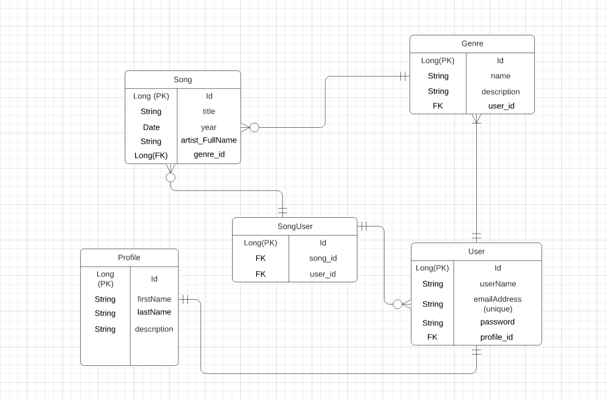
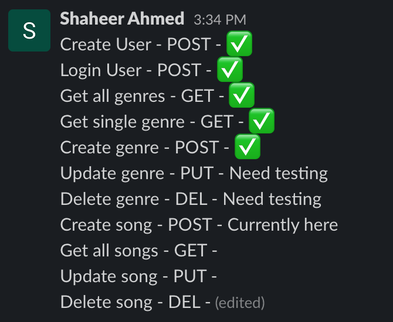
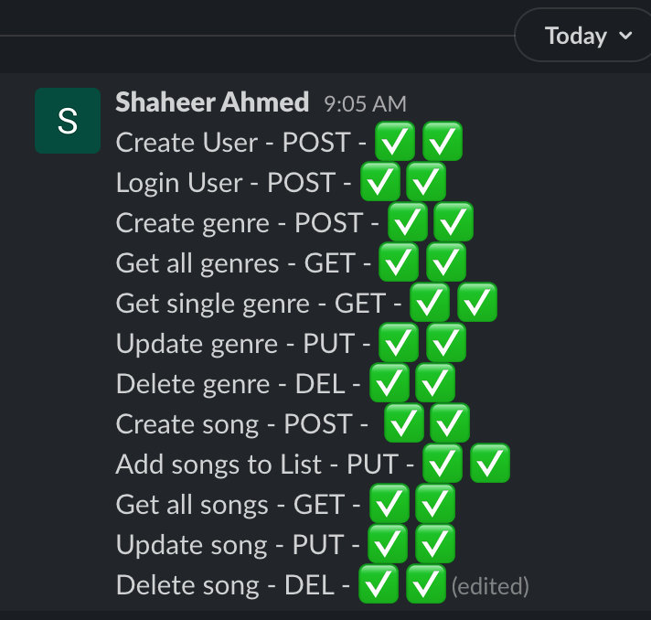

MusicApp README FILE

Machineries and Dependencies Installation:

1. IntelliJ - IDE on PC used to develop project
2. PostgresSQL/pgAdmin4 - software used to set up server and database
3. Postman - software used to create an API environment to send and receive http requests at specific endpoints (main interface used to run program)
4. CLI - Command-Line-Interface used in conjunction with Git to manage project repo and files from local machine to GitHub repo
5. Pom.xml file within a Spring app requires a handful of dependencies to be installed:
   
GroupId: org.springframework.boot
   
ArtifactIds: spring-boot-starter, spring-boot-starter-test, spring-boot-starter-web (verion 2.4.4), spring-boot-starter-data-jpa, spring-boot-starter-security
   
GroupId: org.postgresql

ArtifactId: postgresql

GroupId: io.jsonwebtoken

Each groupId and ArtifactId should be enclosed in <> brackets and the entire pair should be enclosed in < Dependency > bracket tags

**Project Goal:** A music app that allows users to create genre-specific list of their favorite songs and be able to save it in their user profile.

**ERD Diagrams:**

Initial mock up:
This was our initial ERD mock up of the MusicApp. It was going have 2 types of users that can have a profile. A regular user and an artist (of the song). The songs would be associated with a single genre. 

We ended up updating the original ERD design. We dropped "artists" table because having the artist table would mean the user would not be able to add a song to their playlist unless the Artist has created a profile and added their song into the database themselves. We did not want the user to not be able to add a song to their playlist just because the artist hasn't added the song yet. We felt this would discourage the user from using the app so we dropped it in favor of a straightforward personal playlist they have full control over.

Connected "songs" table with "users" table using many to many connections.
Updated ERD diagram incorporating third table used for many to many connections between "songs" and "users" table.

**GENERAL APPROACH + DELIVERABLE BREAKDOWN/TRACKING:** 
1. We first approached the project with the thought of what kind of app can have categorized items relationship and thought of music/songs.
2. Then we went straight to the ERD tool to hash out the entities involved, the relationships between those entities and the data they will house.
3. We broke down the tasks by areas to tackle: models/entities, repositories, controllers/services
4. We intended to get the basic CRUD operations going first and then incorporate the Security/JWT feature but figured to save ourselves refactoring later and just implemented it during the controller/service task
5. With Security/JWT came user login and so we incorporated that in between with Bearer Tokens.
6. Lastly, we circled back to all the Endpoints to ensure Exception Handling and then implemented User Profile capability 
7. ReadMe was being updated along the way, until we faced a major hurdle (below) that halted the ReadMe until the end.

We kept track of endpoint method calls like this and checking off when each one gets completed.
At end of day, we update that list with status and current place.

The multiple checks represents iterations. 

First iteration, we tested the method in Postman right after each one is implemented.

Second iteration, we tested each method as a use-case as if a user were to do it from beginning to end.

Third iteration, we ran through each one ensuring exception handling at each endpoint.

**UNSOLVED PROBLEMS / MAJOR HURDLES:**

There was one major hurdle that we faced. Populating a dynamically created JoinTable using Jpa annotations (instead of creating an Entity and Repository for itself) was working 90%. It was correctly associating the song with the user that created it but instead of INSERTing into the JoinTable one after another, it was replacing the existing row. We did plenty of research and attempted various possible adjustments and ideas but ultimately, nothing was working.

After more research and consultation with a few colleagues, it was determined and concluded that we needed to refactor and implement another solution whilst keeping the JoinTable functionality since a many-to-many connection requires it so to maintain table integrity.
The solution was instead of adding the song, associating it to user and then doing a POST to the JoinTable in one method, we split it up into 2 methods.
The song must be created by the user first (creation and association) and then the user must add the songs to their playlist via another method.

This proved to be successful and also allowed us to retrieve the data from the JoinTable better than before.

Another problem faced during project development was getting database error "FATAL: Too many clients already". To overcome this problem we had to reset postgre service and update developer environment properties.  

**ENDPOINTS:** Endpoints open for Public and Private access. First user "*/register" to create a user. Login to existing account to access
"Private" endpoints. Any spot in the endpoints referencing {genreId} or {songId}, the respective id must be supplied in order to perform said operation.

Create/Register a user (PUBLIC, POST) = http://localhost:{PORT-NUMBER}/auth/users/register

Login User (PUBLIC, POST) = http://localhost:{PORT-NUMBER}/auth/users/login

Update user password (PRIVATE, PUT) = http://localhost:{PORT-NUMBER}/auth/users/changepassword

Create user profile (PRIVATE, POST) = http://localhost:{PORT-NUMBER}/api/profile

Update user profile (PRIVATE, PUT) = http://localhost:{PORT-NUMBER}/api/profile

Create a genre (PRIVATE, POST) = http://localhost:{PORT-NUMBER}/api/genres

Read (get) all genres (PRIVATE, GET) = http://localhost:{PORT-NUMBER}/api/genres

Read (get) single genre (PRIVATE, GET) = http://localhost:{PORT-NUMBER}/api/genres/{genreId}

Update a genre (PRIVATE, PUT) = http://localhost:{PORT-NUMBER}/api/genres/{genreId}

Delete a genre (PRIVATE, DEL) = http://localhost:{PORT-NUMBER}/api/genres/{genreId}

Create a song (PRIVATE, POST) = http://localhost:{PORT-NUMBER}/api/genres/{genreId}/songs

Read (get) all songs (PRIVATE, GET) = http://localhost:{PORT-NUMBER}/songs

Read (get) all user's songs (PRIVATE, GET) = http://localhost:{PORT-NUMBER}/api/genres/{genreId}/songs

Update user song (PRIVATE, PUT) = http://localhost:{PORT-NUMBER}/api/genres/{genreId}/songs/{songId}

Delete user song (PRIVATE, DEL) = http://localhost:{PORT-NUMBER}/api/genres/{genreId}/songs/{songId}

Add songs to user playlist (PRIVATE, PUT) = http://localhost:{PORT-NUMBER}/api/genres/{genreId}/songsList
