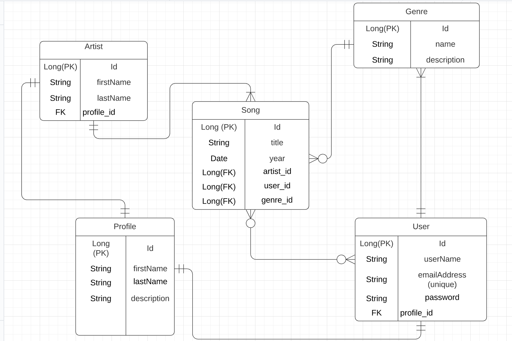

MUSICAPP README FILE

**Project Goal:** A music app that allows users to create genre-specific list of their favorite songs and be able to save it in their user profile.

**ERD Diagrams:**

Initial mock up:
This was our initial ERD mock up of the MusicApp. It was going have 2 types of users that can have a profile. A regular user and an artist (of the song). The songs would be associated with a single genre. 

We ended up updating the original ERD design. We dropped "artists" table because having the artist table would mean the user would not be able to add a song to their playlist unless the Artist has created a profile and added their song into the database themselves. We did not want the user to not be able to add a song to their playlist just because the artist hasn't added the song yet. We felt this would discourage the user from using the app so we dropped it in favor of a straightforward personal playlist they have full control over.

Connected "songs" table with "users" table using many to many connections.
Updated ERD diagram incorporating third table used for many to many connections between "songs" and "users" table.

Endpoints open for Public and Private access. First user "*/register" to create a user. Login to existing account to access
"Private" endpoints. Any spot in the endpoints referencing {genreId} or {songId}, the respective id must be supplied in order to perform said operation.

Create/Register a user (PUBLIC, POST) = http://localhost:9093/auth/users/register

Login User (PUBLIC, POST) = http://localhost:9093/auth/users/login

Create user profile (PRIVATE, POST) = http://localhost:9093/api/profile

Update user profile (PRIVATE, PUT) = http://localhost:9093/api/profile

Create a genre (PRIVATE, POST) = http://localhost:9093/api/genres

Read (get) all genres (PRIVATE, GET) = http://localhost:9093/api/genres

Read (get) single genre (PRIVATE, GET) = http://localhost:9093/api/genres/{genreId}

Update a genre (PRIVATE, PUT) = http://localhost:9093/api/genres/{genreId}

Delete a genre (PRIVATE, DEL) = http://localhost:9093/api/genres/{genreId}

Create a song (PRIVATE, POST) = http://localhost:9093/api/genres/{genreId}/songs

Read (get) all songs (PRIVATE, GET) = http://localhost:9093/songs

Read (get) all user's songs (PRIVATE, GET) = http://localhost:9093/api/genres/{genreId}/songs

Update user song (PRIVATE, PUT) = http://localhost:9093/api/genres/{genreId}/songs/{songId}

Delete user song (PRIVATE, DEL) = http://localhost:9093/api/genres/{genreId}/songs/{songId}

Add songs to user playlist (PRIVATE, PUT) = http://localhost:9093/api/genres/{genreId}/songsList
